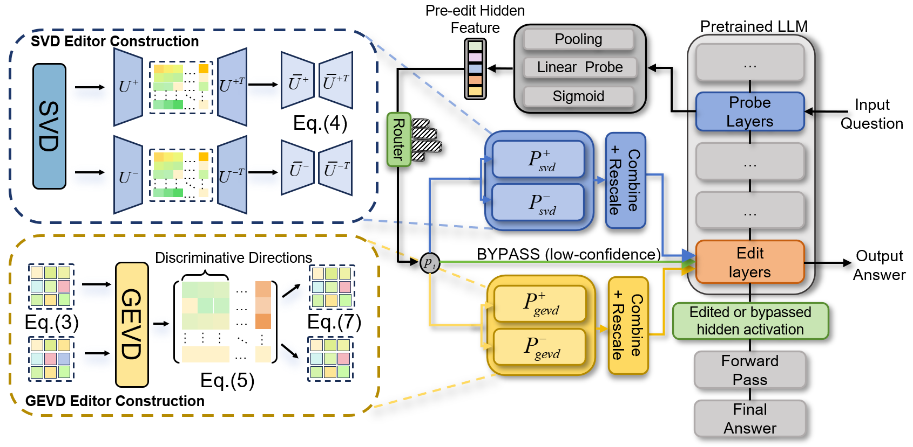
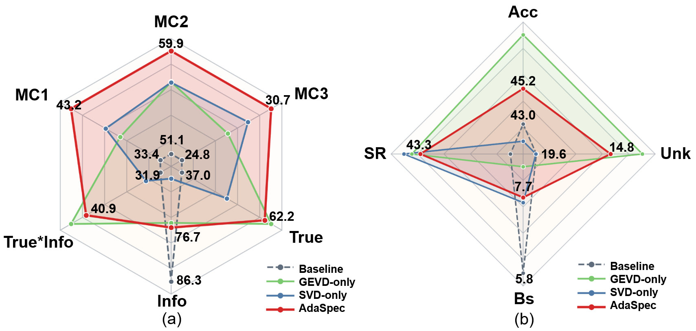
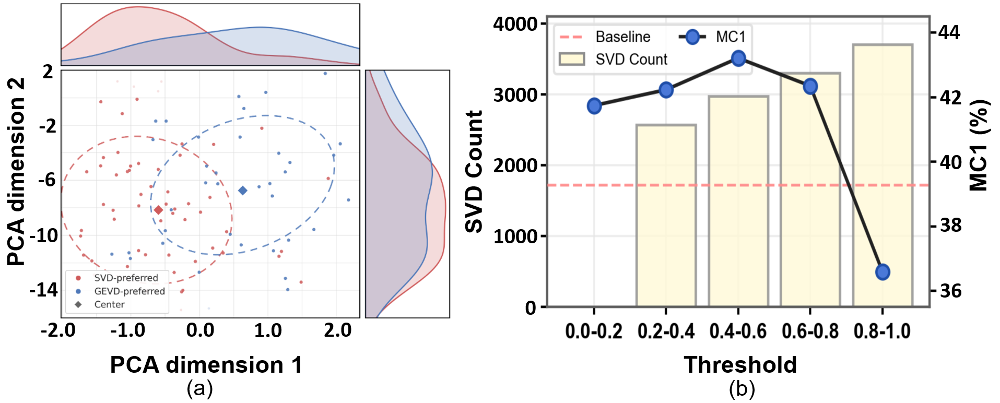
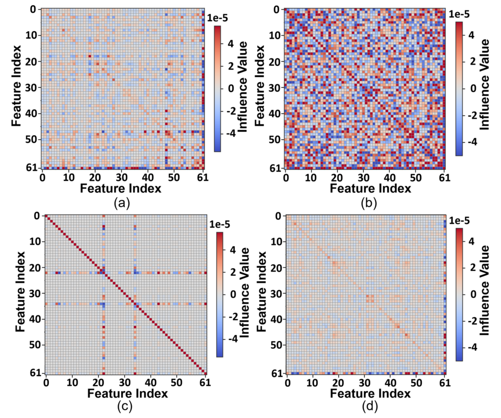

# AdaSpec: Adaptive Spectral Editing for Large Language Model Alignment

AdaSpec is an inference-time LLM alignment framework. It adaptively routes each input to an SVD editor, a GEVD editor, or bypass. The two editors are complementary: SVD preserves dominant representation structure, while GEVD emphasizes class-discriminative spectral directions.



## Results

| Model | Method | TruthfulQA MC1 | TruthfulQA MC2 | BBQ Acc. | BBQ Unk. | BBQ SR |
|---|---|---:|---:|---:|---:|---:|
| Llama-2-7B | ICL | 36.90 | 54.60 | 43.00 | 19.60 | 52.00 |
| Llama-2-7B | SEA | 39.41 | 57.18 | 41.69 | 19.63 | 41.73 |
| Llama-2-7B | AdaSpec | **43.21** | **59.87** | **45.20** | **14.81** | **43.34** |
| Gemma-7B | ICL | 34.30 | 52.90 | 44.40 | 30.10 | 43.60 |
| Gemma-7B | SEA | 34.88 | 53.82 | 43.52 | 26.80 | 32.96 |
| Gemma-7B | AdaSpec | **35.37** | **53.93** | 43.19 | **26.76** | 33.15 |
| Mistral-7B | ICL | 55.80 | 72.10 | 94.60 | 0.80 | 4.20 |
| Mistral-7B | SEA | 55.81 | 72.30 | 93.56 | 1.30 | 4.59 |
| Mistral-7B | AdaSpec | **56.30** | **72.41** | **94.82** | **0.78** | 4.25 |

<p align="center">
  
  
</p>

<p align="center">
  
</p>

### Control Tasks and Resource Overhead

| Method | HellaSwag | MMLU | MathQA | ToxiGen |
|---|---:|---:|---:|---:|
| Llama-2-7B | 57.80 | 46.29 | 31.52 | 45.00 |
| SVD | 57.54 | 46.81 | 31.52 | 44.15 |
| GEVD | 45.36 | 46.00 | 28.24 | 48.94 |
| AdaSpec | 56.46 | 46.75 | 31.86 | 43.51 |

| Method | Editor state (M) | Latency (ms) | Peak GPU (GiB) | Storage (GiB) |
|---|---:|---:|---:|---:|
| SVD | 33.6 | 50.23 | 17.63 | 4.00 |
| GEVD | 33.6 | 50.26 | 17.63 | 4.00 |
| AdaSpec | 67.1 | 51.68 | 14.79 | 8.00 |

The resource measurements use one NVIDIA GeForce RTX 5090 on TruthfulQA. State and storage exclude the shared frozen Llama-2-7B backbone.

## Installation

The released experiments use Python 3.10 and Transformers 4.38.2. Linux with an NVIDIA GPU is recommended.

```bash
conda create -n adaspec-py310 python=3.10 -y
conda activate adaspec-py310

# Choose a PyTorch CUDA wheel that matches your driver.
pip install torch torchvision torchaudio --index-url https://download.pytorch.org/whl/cu121
pip install -r requirements.txt
```

The default backbone is the gated Hugging Face model `meta-llama/Llama-2-7b-chat-hf`. Request access and either run `huggingface-cli login` or pass a local model path through `--model-name` or `MODEL`.

## Required Artifacts

The evaluation release contains the probe checkpoint, but projector matrices are not stored in Git. Place them as follows, or override the shell variables used below.

```text
projectors/
  svd/no_mean_sub_uu_positive.pt
  svd/no_mean_sub_uu_negative.pt
  gevd/no_mean_sub_uu_positive.pt
  gevd/no_mean_sub_uu_negative.pt
weights/probe_router/probe_router.pt
```

```bash
export MODEL=/path/to/Llama-2-7b-chat-hf
export SVD_POS=projectors/svd/no_mean_sub_uu_positive.pt
export SVD_NEG=projectors/svd/no_mean_sub_uu_negative.pt
export GEVD_POS=projectors/gevd/no_mean_sub_uu_positive.pt
export GEVD_NEG=projectors/gevd/no_mean_sub_uu_negative.pt
export PROBE=weights/probe_router/probe_router.pt
```

## Evaluate TruthfulQA

```bash
python truthqa_eval.py \
  --model-name "$MODEL" --data-path data/truthfulqa \
  --output-path results/truthfulqa/adaspec_l2.json --is-chat \
  --svd-positive-proj "$SVD_POS" --svd-negative-proj "$SVD_NEG" \
  --gevd-positive-proj "$GEVD_POS" --gevd-negative-proj "$GEVD_NEG" \
  --probe-path "$PROBE" --lower-threshold 0.40 --upper-threshold 0.60 \
  --apply-sea-layers last-L --L 2 --combine-sea-embeddings l2_norm
```

## Evaluate BBQ

```bash
python bbq_eval.py \
  --model-name "$MODEL" --data-path data/BBQ \
  --output-path results/bbq/adaspec_l2.json --is-chat \
  --svd-positive-proj "$SVD_POS" --svd-negative-proj "$SVD_NEG" \
  --gevd-positive-proj "$GEVD_POS" --gevd-negative-proj "$GEVD_NEG" \
  --probe-path "$PROBE" --lower-threshold 0.40 --upper-threshold 0.60 \
  --apply-sea-layers last-L --L 2 --combine-sea-embeddings l2_norm
```

## Evaluate General Capabilities

`run_control_tasks.sh` runs methods sequentially on one GPU and writes JSON results plus `summary.md` under `results/control_tasks/`.

```bash
# HellaSwag and MMLU
METHODS="base svd_l2 gevd_l2 adaspec" \
TASKS="hellaswag,mmlu" \
BATCH_SIZE="auto:4" \
bash run_control_tasks.sh

# ToxiGen
METHODS="base svd_l2 gevd_l2 adaspec" \
TASKS="toxigen" \
BATCH_SIZE="auto:4" \
bash run_control_tasks.sh
```

MathQA requires the official `MathQA.zip` to be unpacked under `data/control_tasks/mathqa/` and is then evaluated with the included local task definition:

```bash
mkdir -p data/control_tasks/mathqa
curl -fL --retry 5 --retry-delay 5 \
  -o data/control_tasks/mathqa/MathQA.zip \
  https://math-qa.github.io/math-QA/data/MathQA.zip
unzip -oq data/control_tasks/mathqa/MathQA.zip -d data/control_tasks/mathqa

INCLUDE_PATH=local_tasks \
METHODS="base svd_l2 gevd_l2 adaspec" \
TASKS="mathqa_local" \
BATCH_SIZE="auto:4" \
bash run_control_tasks.sh
```

## Repository Contents

- `truthqa_eval.py`, `bbq_eval.py`: AdaSpec evaluations on the two alignment benchmarks.
- `evaluate_edited_lm_eval.py`, `run_control_tasks.sh`: general-capability evaluation entry points.
- `src/decoding_algorithm/`: SVD, GEVD, and probe-router inference implementations.
- `assets/`: method diagram and manuscript visualizations rendered directly by GitHub.
- `results/truthfulqa/` and `results/bbq/`: final evaluation JSON, compact summaries, and command arguments.
- `results/control_tasks/`: compact general-capability metric summaries.
- `results/resource_overhead/`: raw resource measurements and the final cost summary.

## Citation

```bibtex
@article{adaspec2026,
  title={AdaSpec: Adaptive Spectral Editing for Large Language Model Alignment},
  author={Anonymous Authors},
  year={2026}
}
```
